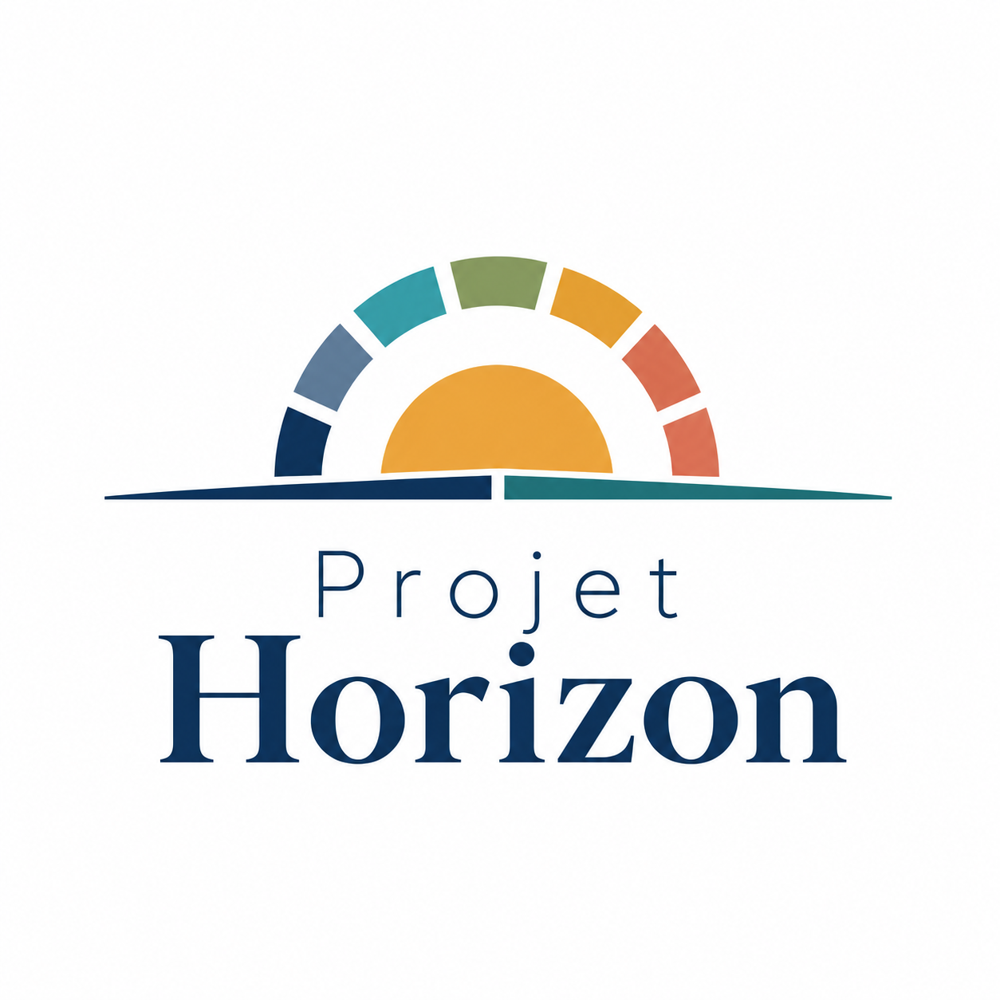

<p align="center">
  
</p>

# Project Horizon

**Project Horizon** est un projet de conception institutionnelle.

Son objectif est de construire, critiquer et améliorer un modèle de gouvernance capable de répondre aux grands défis du XXIe siècle : climat, limites planétaires, automatisation, intelligence artificielle, énergie, logement, alimentation, santé, démocratie et stabilité sociale.

Ce dépôt n'est pas un programme électoral. Ce n'est pas un parti politique. Ce n'est pas un manifeste figé.

C'est une base de travail versionnée.

---

## Hypothèse centrale

Les sociétés modernes prennent trop souvent leurs décisions selon des cycles courts : élections, sondages, intérêts économiques immédiats, arbitrages budgétaires annuels.

Project Horizon part d'une autre hypothèse :

> Une société durable doit séparer plus clairement les contraintes objectives du réel, les modèles scientifiquement validés, les arbitrages démocratiques et la mise en œuvre politique.

Le projet explore donc un modèle où :

- les limites physiques sont définies par les sciences ;
- l'intelligence artificielle sert à analyser, simuler et comparer les trajectoires ;
- les scientifiques proposent des modèles compatibles avec les contraintes du réel ;
- les responsables politiques appliquent uniquement des modèles validés, sans en modifier les règles fondamentales ;
- les citoyens conservent un rôle démocratique sur les valeurs, la justice sociale, les priorités collectives et le contrôle des institutions ;
- les besoins fondamentaux sont garantis à chaque personne ;
- l'économie de marché reste possible au-delà de ce socle, dans des limites écologiques explicites.

---

## Ce que le projet cherche à produire

Project Horizon vise à produire un modèle cohérent de gouvernance, pas une liste de mesures isolées.

Le dépôt doit progressivement répondre à des questions comme :

- Comment choisir les scientifiques et les organismes d'expertise ?
- Comment empêcher la capture des institutions par les lobbies ?
- Quel rôle exact donner à l'IA ?
- Comment garantir les besoins fondamentaux sans supprimer la liberté individuelle ?
- Comment organiser une économie moins dépendante de la croissance matérielle ?
- Comment relocaliser les secteurs critiques sans tomber dans l'autarcie ?
- Comment préserver la démocratie sans laisser les faits scientifiques devenir négociables ?

---

## Méthode

Chaque proposition importante doit être traitée comme une hypothèse de conception.

Elle doit préciser :

1. le problème qu'elle cherche à résoudre ;
2. les contraintes à respecter ;
3. les alternatives étudiées ;
4. les risques identifiés ;
5. les conditions qui pourraient nous faire changer d'avis.

Le projet utilise quatre niveaux de certitude :

- **Établi** : soutenu par un consensus scientifique solide ;
- **Probable** : cohérent avec plusieurs travaux sérieux, mais encore débattu ;
- **Hypothèse** : proposition du modèle, plausible mais à tester ;
- **Question ouverte** : point non résolu ou volontairement laissé en débat.

---

## Structure du dépôt

```txt
.
├── README.md
├── AGENTS.md
├── LICENSE
├── CHANGELOG.md
├── CONTRIBUTING.md
├── docs/
│   ├── 00-index.md
│   ├── 01-vision.md
│   ├── 02-principes.md
│   ├── 03-institutions.md
│   ├── 04-socle-vital.md
│   ├── 05-economie.md
│   ├── 06-energie.md
│   ├── 07-environnement.md
│   ├── 08-ia.md
│   ├── 09-democratie.md
│   ├── 10-international.md
│   ├── 11-transition.md
│   ├── _template.md
│   ├── glossary.md
│   └── faq.md
├── research/
│   ├── bibliography.md
│   ├── inspirations.md
│   ├── criticisms.md
│   ├── case-studies.md
│   └── papers/
├── assets/
└── .blueprint/
    ├── context.md
    ├── ai-instructions.md
    ├── style-guide.md
    ├── decisions.md
    └── roadmap.md
```

---

## Dossier `.blueprint`

Le dossier `.blueprint` contient la mémoire de travail du projet.

Il sert à guider les sessions avec des assistants IA, notamment dans VS Code ou VS Codium. Avant toute modification importante, l'agent doit lire :

- `.blueprint/context.md`
- `.blueprint/ai-instructions.md`
- `.blueprint/style-guide.md`
- `.blueprint/decisions.md`

Cela permet de préserver la cohérence du projet sur plusieurs semaines ou plusieurs mois.

---

## Licence

Sauf indication contraire, le contenu de ce dépôt est placé sous licence **Creative Commons Attribution 4.0 International**.

Vous pouvez partager et adapter le contenu, y compris à des fins commerciales, à condition de créditer la source et d'indiquer les modifications effectuées.

Voir `LICENSE` pour plus de détails.

---

## Statut

Project Horizon est actuellement un **working draft**.

La priorité n'est pas encore de publier, convaincre ou fédérer. La priorité est de construire un modèle assez clair pour pouvoir être critiqué sérieusement.

---

## Pourquoi ce projet ?

J'ai eu envie de créer Project Horizon parce que je ne me reconnais pas vraiment dans l'offre politique actuelle, notamment en Belgique, lorsqu'il s'agit de penser le court, le moyen et le long terme ensemble.

J'ai souvent le sentiment que les décisions publiques restent enfermées dans l'horizon d'une législature : gagner les prochaines élections, préserver une image, éviter une mesure impopulaire, répondre au conflit immédiat. Cette logique peut faire passer le calcul électoral avant les besoins humains, alors que les problèmes les plus importants dépassent largement un mandat.

Une autre motivation vient du sentiment que la parole scientifique est trop facilement relativisée ou ignorée lorsque ses conclusions dérangent. La période récente a montré, dans plusieurs pays, combien une culture politique de post-vérité pouvait fragiliser la santé publique, le climat, les institutions et la confiance collective.

Je ne pars pas non plus d'un rejet total du marché, mais d'une inquiétude face à un capitalisme insuffisamment borné. Lorsqu'il accepte des inégalités très dures, externalise les coûts écologiques ou dépend trop fortement des lobbies, il ne sert plus durablement l'ensemble des personnes. Les lobbies posent ici un problème particulier : ils peuvent nourrir les décisions publiques avec les intérêts du capital plutôt qu'avec les besoins humains, les limites physiques et l'intérêt général.

Project Horizon vient de cette insatisfaction. Le projet cherche un cadre qui parte moins des doctrines et davantage des conditions de vie : garantir la dignité, préserver les libertés, écouter les sciences sans leur donner tout le pouvoir, empêcher la capture des institutions, rendre les décisions vérifiables, et éviter qu'un parti, un marché, une IA ou une élite fermée puisse décider seul.

Le projet est open source parce qu'un tel modèle ne devrait pas dépendre d'une intuition privée ou d'un cercle restreint. Il doit pouvoir être lu, critiqué, corrigé, sourcé et contredit par des personnes qui ne partagent pas forcément les mêmes hypothèses de départ.

Project Horizon n'est donc pas une réponse définitive. C'est une tentative de construire un espace de travail rigoureux autour d'une question simple : comment organiser une société qui serve d'abord les besoins humains, sans nier le réel, sans abandonner les libertés, et sans laisser les décisions longues aux seuls intérêts de court terme ?
